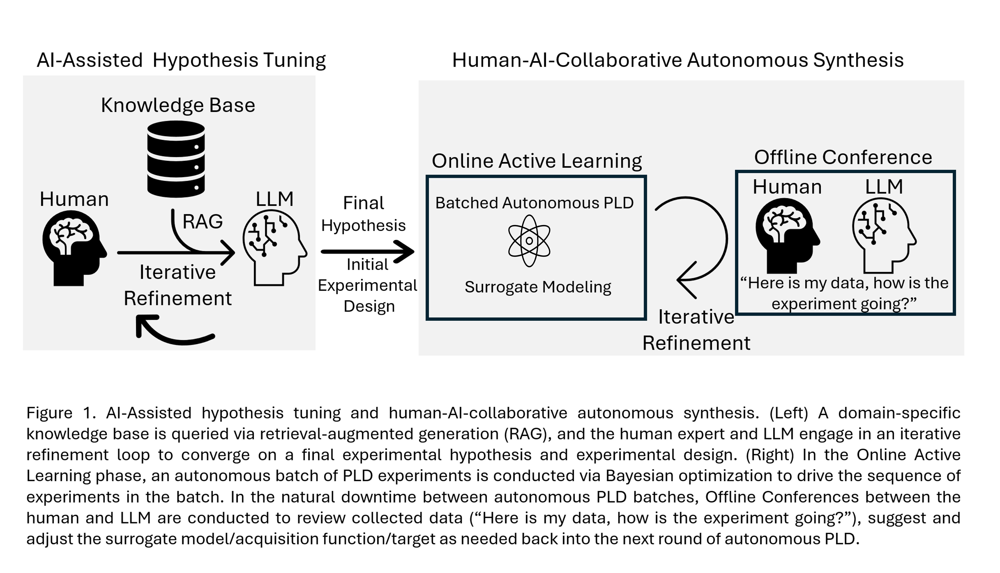
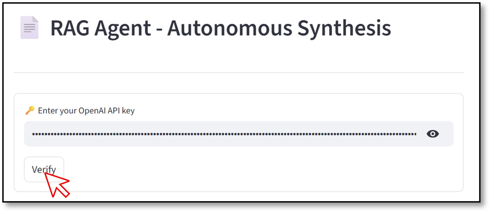
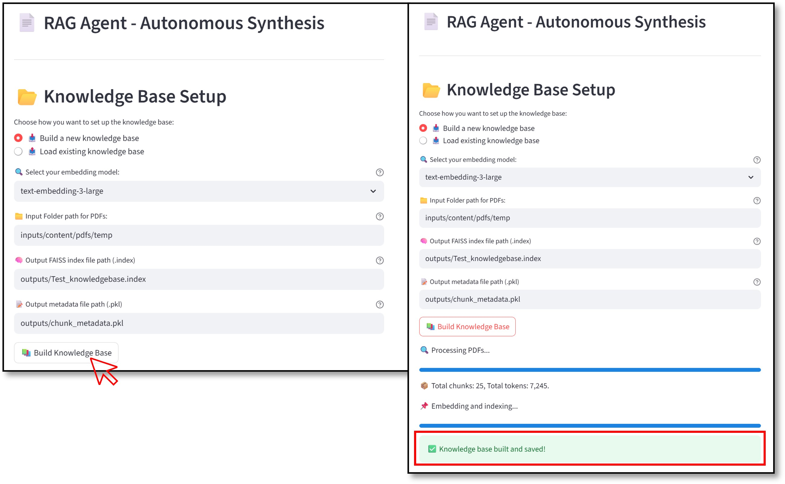
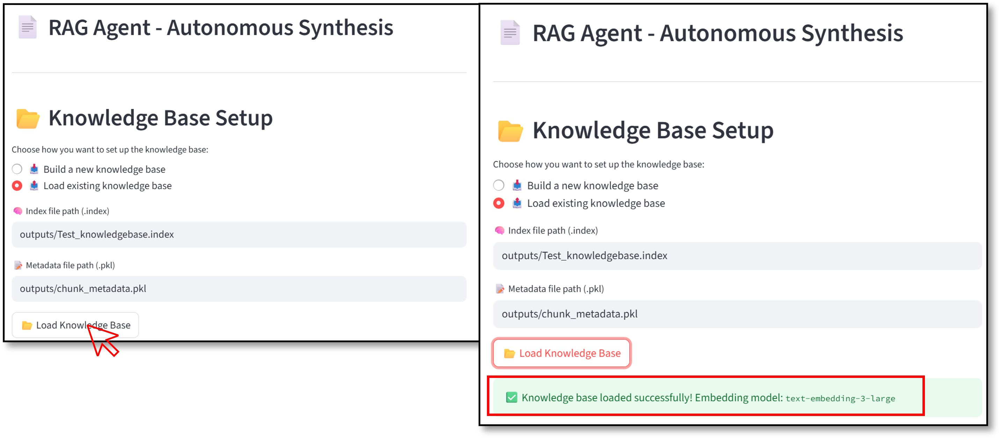
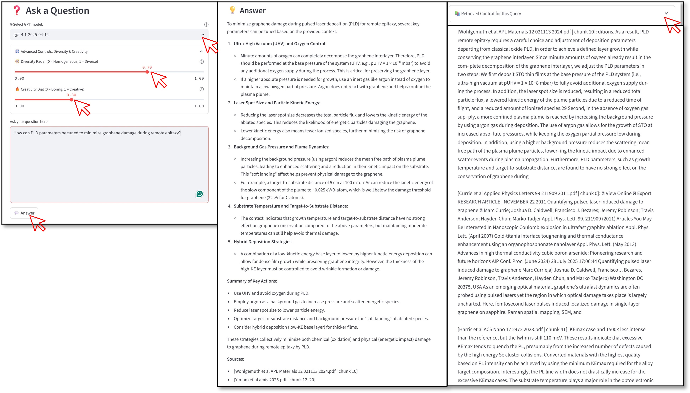

# 📄 RAG Pipeline for Hypothesis Refinement in Autonomous Materials Synthesis  

This repository hosts a **Retrieval-Augmented Generation (RAG) system** designed for **AI-assisted hypothesis refinement** in autonomous materials synthesis workflows (e.g., Pulsed Laser Deposition – PLD, Remote Epitaxy, BaTiO₃ thin films). The pipeline integrates **state-of-the-art LLMs** with a curated knowledge base of >340 domain-specific literature to guide **experimental design before running autonomous experiments**.  

The system enables researchers to:  
- 📚 Query a domain knowledge base (remote epitaxy, PLD, BaTiO₃, graphene, Raman spectroscopy, etc.).  
- 🧠 Refine experimental hypotheses with **LLM-assisted reasoning + RAG**.  
- ⚙️ Receive suggested parameter ranges and optimization targets for **Bayesian Optimization loops in PLD**.  
- 🔄 Provide experimental results and receive iterative suggestions during **human–AI offline conferences**.  

---

## 🚀 Workflow Overview  

<p align="center">
  
</p>  

### 📂 Knowledge Base Construction  
- Curated literature (>340) spanning **PLD**, **remote epitaxy**, **graphene**, **BaTiO₃**, **oxide membranes**, **2D material transfer**, **ferroelectricity**, etc.  
- PDFs are parsed, cleaned, chunked, embedded with OpenAI SOTA embedding model, and stored in a **FAISS index** for later query-retrieval procedure.  

### 🧠 AI-Assisted Hypothesis Tuning (Pre-Experiment)  
- Research context + structured prompts are combined with retrieved literature.  
- LLM proposes refined hypotheses, **parameter ranges** (e.g., pressure, substrate temperature, protective layer thickness), and rationale with inline citations.  

### ⚙️ Autonomous PLD Experiments  
- Hypotheses are tested in **batched PLD runs (e.g., 5-10 samples)** using GPBO optimization.  
- Data collection and **Raman spectroscopy analysis** are automated.  

### 🔄 Human–AI Offline Conference  
- During downtime, researchers provide existing data/findings back to the LLM.  
- LLM evaluates progress, suggests surrogate/acquisition function updates, and decides if experiments should continue.  

---

## 📂 Repository Structure  

```
.
├── app.py                     # Main application (UI + RAG pipeline)
├── requirements.txt           # Dependencies
├── run_demo_unix.sh           # Linux/MacOS launch script
├── run_demo_windows.bat       # Windows launch script
├── inputs/                    # Example folder for input PDFs
├── outputs/                   # Example folder for knowledge base index/metadata
├── assets/                    # Images (Demo)
└── README.md                  # Documentation
```

---

## ⚙️ Installation & Setup  

> ✅ **Recommended Python version: 3.10+**

### 🐧 Linux/MacOS Users  

1. Make the script executable:  
   ```bash
   chmod +x run_demo_unix.sh
   ```
2. Run the demo:  
   ```bash
   ./run_demo_unix.sh
   ```

### 🪟 Windows Users  

#### Uses 'uv' Package Manager (Recommended)  
Simply double-click:  
```bash
run_demo_windows.bat
```

---

## 📦 Dependencies  

Dependencies are listed in `requirements.txt`:  

```
tiktoken==0.9.0
openai==1.96.1
langchain==0.3.26
langchain-community==0.3.27
langchain-core==0.3.68
langchain-text-splitters==0.3.8
streamlit==1.47.0
PyMuPDF==1.26.3
faiss-cpu==1.11.0.post1
numpy
pycountry==24.6.1
```

---

## 🖥️ Usage Instructions  

### 1. Verify API Key  
When you launch the app, you'll be prompted to enter your **OpenAI API key**.  
This is required for generating/using embeddings + GPT responses.  

### 2. Build or Load Knowledge Base  
- **Option A: Build New KB** – Provide a folder of PDFs, select an embedding model  
  (`text-embedding-3-small` or `text-embedding-3-large`), and the system will chunk,  
  embed, and index the documents into FAISS.  
- **Option B: Load Existing KB** – Provide paths to a `.index` file and corresponding `.pkl` metadata.  

### 3. Ask Questions / Hypothesis Tuning  
- Enter your query in the text area (e.g., *“How can PLD parameters be tuned to minimize graphene damage during remote epitaxy?”*).  
- The system retrieves **top-k diverse chunks** (default k=50), augments them with your query, and sends them to the GPT model. The UI allows you to control different configurations e.g., diversity of the retrieved contexts.  
- Output includes: OpenAI's SOTA model response based on the query and the context (e.g., Hypothesis statement, Suggested PLD parameter ranges, Rationale with inline citations, etc.)

### 4. Experimental Feedback Loop  
- During PLD experiment downtime, results are provided back into the system.  
- The LLM suggests **parameter adjustments, surrogate model updates, or experiment stopping criteria**.  

---

## 📸 Demo  

Below is a walkthrough of the RAG Agent interface in action, with step-by-step screenshots.  

---

### 1. API Key Verification  
When you first launch the app, you’ll be prompted to enter and verify your **OpenAI API key**.  

<p align="center">
  <br>
  <em>Verifying your OpenAI API key to enable embeddings and GPT responses.</em>
</p>  

---

### 2. Build a Knowledge Base  
You can create a new knowledge base from domain-specific PDFs.  
- Select an embedding model (`text-embedding-3-small` or `text-embedding-3-large`).  
- Provide the input folder path for your PDFs.  
- Define output locations for the FAISS index and metadata file.  

<p align="center">
  <br>
  <em>Building a new knowledge base from a collection of scientific PDFs.</em>
</p>  

---

### 3. Load an Existing Knowledge Base  
If you already have a knowledge base built, simply load it by specifying the paths to the `.index` and `.pkl` metadata files.  

<p align="center">
  <br>
  <em>Loading an existing FAISS index and metadata for quick use.</em>
</p>  

---

### 4. Ask Questions with RAG  
Once the knowledge base is ready, you can:  
- Select a GPT model for answering queries.  
- Control **diversity** and **creativity** of responses.  
- Provide a research question to receive a **RAG-informed response**.  
- View references and expand the retrieved context to better understand which sources were used.  

<p align="center">
  <br>
  <em>Asking a scientific question and receiving a RAG-informed hypothesis with citations.</em>
</p>  

---

This pipeline allows researchers to move from **domain literature → refined hypotheses → guided experiments**.

---

## 📜 License  

MIT License. See [LICENSE](LICENSE) file for details.  

---

📌 If you find this work useful, please **cite the original paper** (details to be updated once available) and ⭐ **star this repository**.  
💬 For questions, feedback, or collaboration opportunities, please open an issue or contact the authors.